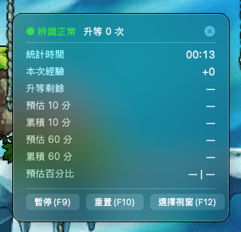
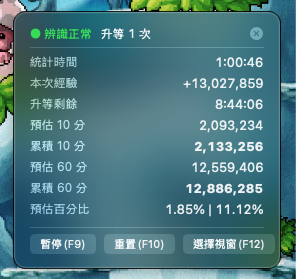

# ArtaleExp

> MapleStory Worlds 平台上《Artale》專用的 macOS 經驗值追蹤小工具

ArtaleExp 是一個常駐在選單列的原生 macOS app，專為 MapleStory Worlds 平台上的遊戲《Artale》設計。它會即時讀取遊戲畫面上的經驗值，替你算出**每分鐘經驗、升等所需時間、抵達目標等級的預估時間、10 分鐘 / 60 分鐘的預估經驗與百分比**，並用一個半透明的懸浮小視窗（HUD）顯示。辨識與統計全程在你的電腦本機運算，不修改遊戲、不注入程式、不與遊戲伺服器通訊。

<p align="center">
  <em>macOS 14 (Sonoma) 以上 · Apple Silicon 與 Intel 皆可 · 免費</em>
</p>

| 剛開始統計 | 掛滿一小時的即時數據 |
|:--:|:--:|
|  |  |

---

## 功能特色

- **即時經驗速率**：每秒擷取一次選定區域，辨識經驗值數字，換算每分鐘速率與升等剩餘時間。
- **內建官方經驗表**（0.6.0 新增）：辨識結果自動對照 1～200 等的官方升級經驗表鎖定你的等級，升等時間與百分比預估用的是精確值，不再只靠畫面反推。
- **目標等級倒數**（0.6.0 新增）：在偏好設定填一個目標等級，HUD 就多一列「距目標等級」，告訴你照目前效率還要練多久。
- **練功成效預估**：顯示 10 分鐘 / 60 分鐘的預估經驗量與百分比，一眼看出這個點值不值得練。
- **懸浮 HUD**：半透明小視窗可自由拖曳擺放；背景透明度、顯示欄位、底部按鈕列都能在偏好設定調整。
- **全域快捷鍵**：不必切回 app，遊戲中直接按鍵控制（預設 F9 / F10 / F12，可自訂）。
- **視窗自動記憶**：記住你上次選的遊戲視窗與框選區域，下次開啟自動接上。
- **辨識異常提示**：畫面被移動或遮住導致讀不到數字時，HUD 會跳出提醒並提供「重新框選」按鈕。
- **自動更新**（0.6.0 新增）：有新版時 app 會自己提示，按一下就完成下載安裝，不必再手動下載換檔。

## 效能特色

掛著練功一整天也不會拖累電腦或遊戲：

- **原生 Swift 打造**：不是 Electron 或瀏覽器包裝的 app，整個 app 不到 5 MB，啟動快、記憶體與 CPU 佔用都很低。
- **只擷取小區域、每秒一次**：不做全螢幕連續錄影，只讀取你框選的那一小條經驗值，運算負擔極輕。
- **本機運算**：文字辨識使用 macOS 內建的 Vision 框架，畫面與統計資料都留在你的電腦上；唯一的網路連線是向 GitHub 檢查有沒有新版本。

## 系統需求

- macOS 14 (Sonoma) 或更新版本，Apple Silicon 與 Intel 皆支援
- 需要授權「螢幕錄製」權限（僅用於讀取你指定的遊戲畫面區域，詳見下方[隱私與安全](#隱私與安全)）

---

## 下載與安裝

### 1. 下載

到 [**Releases 頁面**](https://github.com/Adam-ChunJung/artale-exp-mac/releases/latest) 下載最新的 `ArtaleExp-x.y.z.zip`，用 macOS 內建的解壓縮（雙擊 zip）得到 `ArtaleExp.app`，拖進「應用程式」資料夾。

> 建議用系統內建方式解壓縮；部分第三方解壓工具會弄壞 app 的簽名或權限，造成打不開。

### 2. 第一次開啟（重要）

這個 app 使用自簽憑證、**未經 Apple 公證**，所以第一次開啟時 macOS 會擋下來（顯示「無法打開，因為無法驗證開發者」）。這是正常的。依你的系統版本選一種方式放行，做**一次**之後就能正常雙擊開啟：

**方法 A — 系統設定「仍要打開」（macOS 15 Sequoia 以上，首選）**

先雙擊一次 `ArtaleExp.app` ——會被擋下來，**這一步是必要的**（讓系統記錄這個 app），接著：

> **系統設定 → 隱私權與安全性 → 往下捲到「仍要打開 ArtaleExp」→ 按下去 → 依提示輸入你的登入（管理者）密碼確認。**

**方法 B — 右鍵打開（macOS 14 Sonoma 適用）**

> **在 `ArtaleExp.app` 上按右鍵 → 選「打開」→ 在跳出的對話框再按一次「打開」。**

（macOS 15 以後 Apple 拿掉了這個捷徑，右鍵選「打開」也一樣會被擋，請改用方法 A。）

**方法 C — 終端機指令（前兩者都失效，或出現「檔案已損毀」時）**

若系統顯示「ArtaleExp 已損毀，無法打開」而完全沒有「仍要打開」的選項，代表要直接清掉 macOS 貼在檔案上的隔離標記。打開「終端機」，貼上以下指令後按 Enter：

```bash
xattr -cr /Applications/ArtaleExp.app
```

（若你把 app 放在別處，請把路徑換成實際位置。若提示權限不足，在指令最前面加上 `sudo ` 再執行一次，會要求輸入登入密碼。）

### 3. 授權螢幕錄製

app 需要讀取遊戲畫面，第一次啟動會請你到系統設定開權限：

> **系統設定 → 隱私權與安全性 → 螢幕錄製（較新版 macOS 名為「螢幕與系統音訊錄製」）→ 把 ArtaleExp 打開。**

打開後依提示按「結束 App」，再重新開啟 ArtaleExp 即可。

> **macOS 15 以上請注意**：系統會**大約每個月**跳一次「ArtaleExp 要求略過系統視窗選取器…是否繼續允許?」的確認框。這是 Apple 對所有螢幕擷取類 app 的統一政策，不是 ArtaleExp 出問題——按「允許一個月」繼續用就好。

---

## 使用方式

啟動後，ArtaleExp 會以一個小圖示常駐在**選單列**（螢幕右上角），不會出現在 Dock。點圖示展開選單操作。

### 基本流程

1. 先開好遊戲。
2. 點選單列圖示 → **選擇視窗**，選你的遊戲視窗。
3. 畫面會凍結成半透明遮罩，**用滑鼠拖曳框出經驗值那一列**（放開滑鼠即確認，按 `Esc` 取消）。框小一點、只框住經驗數字那條，辨識最準。
4. HUD 出現後，按 **F9（開始）** 開始統計。app 預設開啟時是「未啟動」狀態，等你按開始。

> 框選區域與遊戲視窗會被記住，下次開啟自動接上，通常不必重選。

### 快捷鍵（預設，可在偏好設定自訂）

| 按鍵 | 動作 |
|------|------|
| `F9`  | 開始 / 暫停 |
| `F10` | 重設統計 |
| `F12` | 選擇視窗 |

> **按了沒反應？** Mac 鍵盤最上排預設是亮度、音量等媒體鍵。請按住 `Fn` 再按 F9，或到「系統設定 → 鍵盤 → 將 F1、F2 等按鍵作為標準功能鍵」開啟後直接按。也可以在偏好設定把快捷鍵改成別的組合。

同樣的動作也都在選單列選單裡：**開始/暫停**、**重設統計**、**選擇視窗**、**清除視窗記憶**。

### 偏好設定（`⌘,`）

- 自訂三個動作的快捷鍵（支援搭配修飾鍵）
- **目標等級**：填 1～200 之間的等級，HUD 顯示抵達目標的預估時間（留空或 0 = 關閉；超過 200 會自動設為 200）
- HUD 背景透明度
- 顯示 / 隱藏各欄位
- 顯示 / 隱藏 HUD 底部的控制按鈕列

## 自動更新

從 0.6.0 起，ArtaleExp 內建自動更新：**有新版時 app 會自己跳出提示，按「安裝更新」就會自動下載、驗證、替換並重新開啟**，不必再手動下載換檔，也不必重新做一次「第一次開啟」的放行步驟。你也可以隨時從選單列 → **檢查更新…** 手動檢查。

> **還在用 0.5.x 的朋友**：舊版沒有自動更新，會提示你前往下載頁。請手動下載 0.6.0 換檔**最後一次**（換檔後要照上面「第一次開啟」再放行一次），之後就全自動了。

每一版的更新內容都寫在 [Releases 頁面](https://github.com/Adam-ChunJung/artale-exp-mac/releases)。

## 隱私與安全

- **畫面資料不離開你的電腦**：螢幕錄製權限只用來以每秒一次的頻率讀取你框選的那一小塊區域，辨識在本機用 macOS 內建框架完成，不儲存、不上傳任何畫面。
- **唯一的網路連線是檢查更新**：app 只會連 GitHub（本頁所在的網站）比對版本與下載新版，更新檔以加密簽章驗證完整性，沒有任何統計、追蹤或回報行為。
- **不碰遊戲本體**：純粹「看畫面上的數字」，不修改遊戲檔案、不讀取遊戲記憶體、不模擬按鍵、不與遊戲伺服器通訊。

## 常見問題

- **用這個會不會被 ban？** ArtaleExp 的原理跟「錄影後用眼睛看」相同——只讀取螢幕畫面，不碰遊戲程式本身（見上方隱私與安全）。但任何第三方工具的使用規範最終由遊戲官方解釋，無法保證絕對安全，請自行評估（見下方免責聲明）。
- **快捷鍵按了沒反應**：見上方「使用方式」的 `Fn` 鍵說明。
- **每次開都被擋 / 找不到「打開」按鈕**：第一次一定要手動放行一次（見安裝步驟 2）。macOS 15 以上請走**系統設定 →「仍要打開」**；顯示「已損毀」時改用**終端機 `xattr` 指令**。
- **HUD 一直讀不到數字 / 跳出辨識異常**：多半是遊戲視窗被移動、縮放或遮住了。點 HUD 上的「重新框選」重新框一次即可。換了螢幕、改了解析度或視窗大小後也建議重框一次。
- **開了螢幕錄製權限還是讀不到**：權限變更後請完全結束 app 再重新開啟。
- **突然跳出「是否繼續允許擷取畫面」**：macOS 15 以上約每月一次的系統例行確認，按「允許一個月」即可（見安裝步驟 3）。
- **HUD 不見了**：點選單列圖示確認 app 還在。若 HUD 被拖到螢幕外，可從選單「重新框選」讓它重新出現。
- **想清掉記住的視窗**：選單列 → 清除視窗記憶。

## 解除安裝

把「應用程式」裡的 `ArtaleExp.app` 丟到垃圾桶即可（選單列 → 關閉按鈕或右上角圖示選單先結束 app）。想清得更乾淨，可再到「系統設定 → 隱私權與安全性 → 螢幕錄製」移除 ArtaleExp 的授權。

---

## 請我喝珍奶 🧋

ArtaleExp 一直都會是免費的。如果使用上還順手，歡迎 [**請我喝杯珍奶**](https://adam-chunjung.bobaboba.me) 當作打賞 —— 完全隨意，你的支持是我繼續維護與更新的動力，謝謝你 🙏

## 免費與免責聲明

ArtaleExp 是免費提供的個人工具。

- 本程式**依現狀（as-is）提供，不含任何明示或默示的擔保**；作者不對使用本程式造成的任何損害負責。
- 本程式為**第三方非官方工具**，與《Artale》的製作團隊、MapleStory Worlds 平台及其營運商均無任何關係。它只讀取畫面上的數字、不修改遊戲、不注入記憶體、不與遊戲伺服器通訊。
- 使用任何第三方工具都可能牽涉遊戲服務條款與帳號風險，**是否使用、以及使用後果由你自行承擔**。
- 所有辨識與統計都在你的電腦本機運算，除檢查更新外不進行任何網路傳輸。

---

© 2026 Adam
